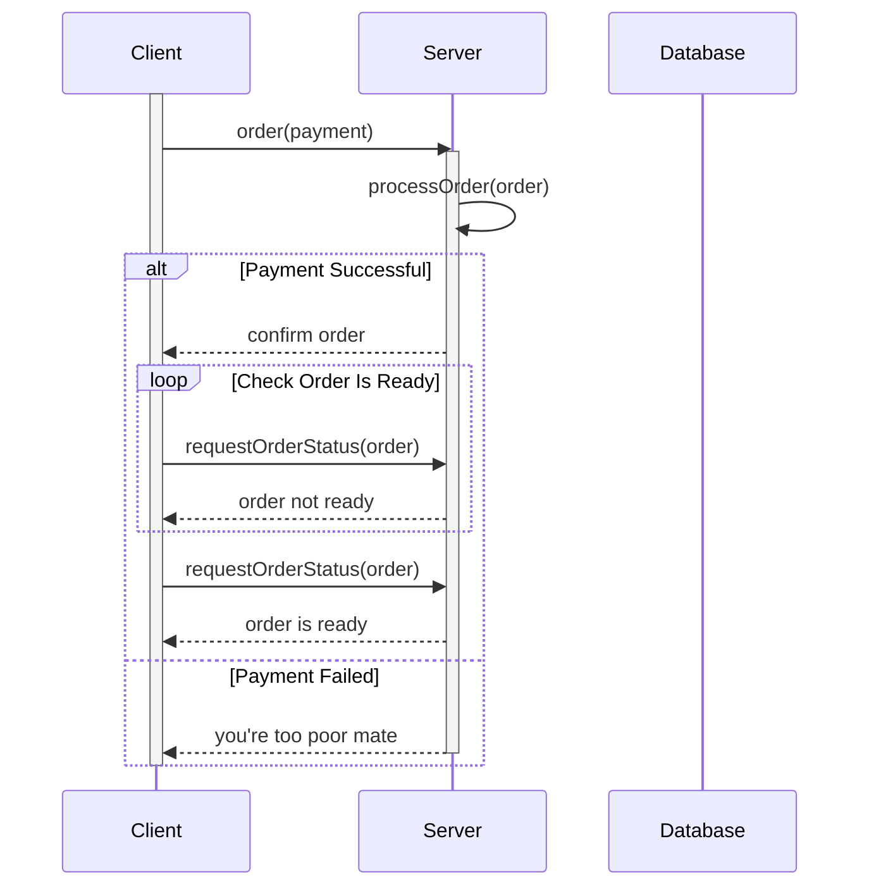

```mermaid
sequenceDiagram
    participant Client
    participant Server
    participant Database

    activate Client
    Client->>Server: order(payment)
    activate Server
    Server->>Server: processOrder(order)

    alt Payment Successful
        Server-->>Client: confirm order
        loop Check Order Is Ready
            Client->>Server: requestOrderStatus(order)
            Server-->>Client: order not ready
        end
        Client->>Server: requestOrderStatus(order)
        Server-->>Client: order is ready
    else Payment Failed
        Server-->>Client: you're too poor mate
        deactivate Server
    end
    deactivate Client
```

Client place order to server,
if succeed, server responds with confirmation
if fail, server responds with error

If order successful, client will keep on asking for when
their order is ready.