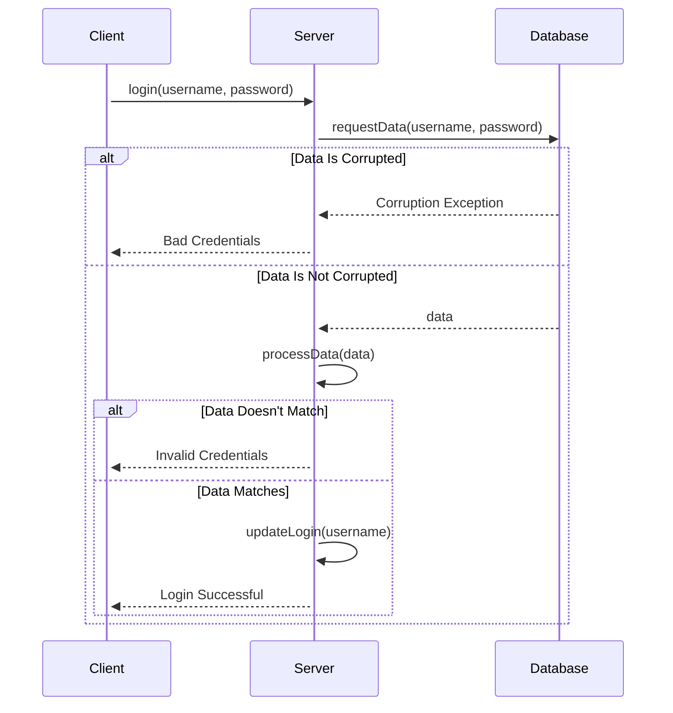

Client tries to login
Server will ask database for credentials
If data exists, server will confirm credentials and try login
If data not match credentials, server will not login
If data is corrupted, or the database screams at the server, server will scream at the user in turn with an exception